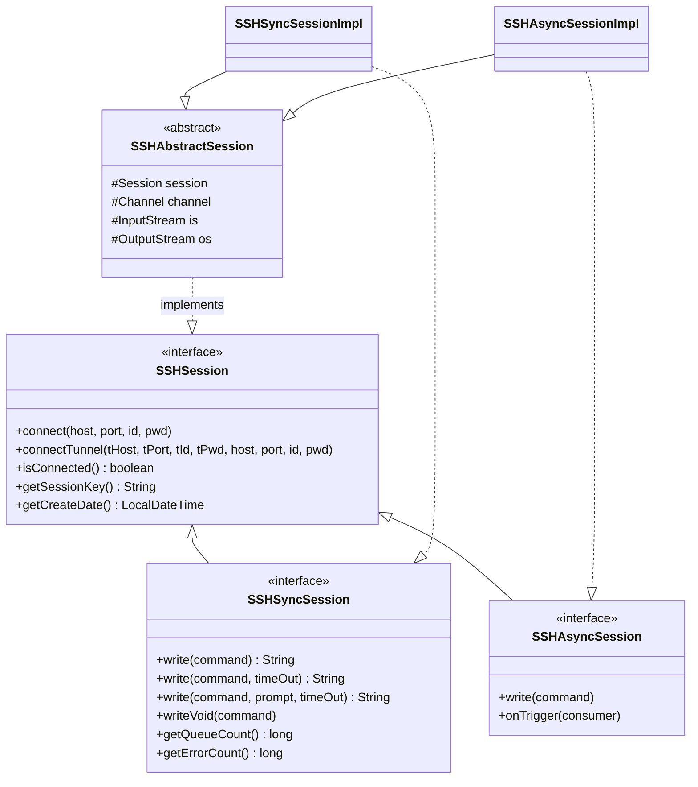

# SSHPool 프로젝트 구조

JSch 기반 SSH/SFTP 클라이언트 라이브러리. 단일 Maven 모듈로, 직접 세션 제어부터 커넥션 풀링, 멀티 호스트(keyed) 풀링까지 3단계 사용 패턴을 제공한다.

## 1. 프로젝트 개요

| 항목 | 값 |
|---|---|
| GroupId / ArtifactId | `com.j2s` / `secure-client` |
| Version | 2.1.3 |
| Java 버전 | source/target 8 |
| MainClass | `com.j2s.secure.SSHPoolMain` (pom.xml, `META-INF/MANIFEST.MF`) |
| 배포 | 내부 repository (`file:./target/deploy`) |
| 테스트 | `maven.test.skip=true` — 빌드 시 비활성 |

### 의존성

| 라이브러리 | 버전 | 용도 |
|---|---|---|
| `com.github.mwiede:jsch` | 0.2.17 | SSH/SFTP 통신 (JSch fork) |
| `org.apache.commons:commons-pool2` | 2.11.1 | SSH 세션 객체 풀 |
| `net.jodah:expiringmap` | 0.5.10 | 만료 시간이 있는 세션 레지스트리 |
| `commons-io:commons-io` | 2.19.0 | SFTP 파일 입출력 유틸 |
| `org.projectlombok:lombok` | 1.18.30 (provided) | 보일러플레이트 제거 |
| `org.slf4j:slf4j-api` | 2.0.6 | 로깅 |
| `org.slf4j:slf4j-simple` / `junit-jupiter` | (test) | 테스트 |

## 2. 패키지 구조

```
com.j2s.secure
├── SSHPoolMain                    # 진입점 (데모용 main)
├── SSHSessionConfig               # 단일 호스트 설정 (host/port/id/pwd)
├── SSHSessionKeyedConfig          # 멀티 호스트 설정 (hosts, host는 @Deprecated)
├── SSHAsyncMessage                # 비동기 메시지 DTO (sessionKey, result)
├── SessionTimer                   # 공유 ScheduledExecutorService 래퍼
├── executors
│   └── SecureExecutors            # 이름이 붙은 스레드 풀 팩토리
├── ssh
│   ├── SSHSession                 # SSH 세션 인터페이스
│   ├── SSHSyncSession             # 동기 세션 인터페이스 (write/writeVoid/메트릭)
│   ├── SSHAsyncSession            # 비동기 세션 인터페이스 (write/onTrigger)
│   ├── SSHAbstractSession         # 공통: 연결, 터널, shell 채널, close
│   ├── SSHSyncSessionImpl         # 동기 세션 구현
│   ├── SSHAsyncSessionImpl        # 비동기 세션 구현
│   ├── SSHSessionFactory          # 세션 생성/조회 (싱글 세션 패턴)
│   ├── SSHSessionManager          # 세션 레지스트리 (enum 싱글톤)
│   ├── SSHSyncSessionPool         # 단일 호스트 풀 (GenericObjectPool)
│   ├── SSHSyncSessionKeyedPool    # 멀티 호스트 풀 (GenericKeyedObjectPool)
│   ├── SSHSyncPoolableObjectFactory       # 풀 팩토리 (create/validate/passivate/destroy)
│   ├── SSHSyncKeyedPoolableObjectFactory  # keyed 풀 팩토리
│   └── ex                         # SSH 예외 계층
└── sftp
    ├── SFTPSession                # SFTP 세션 인터페이스
    ├── SFTPAbstractSession        # 공통: 연결, 터널, sftp 채널, close
    ├── SFTPSessionImpl            # SFTP 구현
    ├── SFTPSessionFactory         # 세션 생성 (싱글 세션 패턴)
    ├── SFTPSessionManager         # 세션 레지스트리 (enum 싱글톤)
    └── ex                         # SFTP 예외 계층
```

## 3. 핵심 아키텍처

3개 계층으로 구성되며, 사용 패턴에 따라 조합해서 사용한다.

### 3.1 세션 계층 (Session)

인터페이스 → 추상 클래스 → 구현체의 3단 구조. SSH와 SFTP가 동일한 형태를 취한다.



- `SSHAbstractSession`: 공통 수명주기 담당.
  - `_connect()`: `JSch` 세션 생성 (timeout 10초), `~/.ssh/id_rsa` 가 존재하면 자동 추가, `StrictHostKeyChecking=no`.
  - `openChannel() (SSH)`: `shell` 채널, PTY `vt102 1000x24`.
  - `openChannel() (SFTP)`: `sftp` 채널.
  - `connectTunnel()`: 터널 서버 접속 → `setPortForwardingL(0, host, port)` 로컬 포트 확보 → `127.0.0.1:로컬포트` 로 최종 접속.
  - `close()`: 자원 정리 후 `SSHSessionManager` 에서 제거.

### 3.2 레지스트리 계층 (SessionManager)

`SSHSessionManager` / `SFTPSessionManager` 는 enum `INSTANCE` 싱글톤. 패턴이 완전히 동일하다.

- **저장소**: `ExpiringMap`
  - 만료 정책 `ACCESSED` (조회 시 만료 갱신)
  - 만료 **10분**
  - `asyncExpirationListener` 가 만료 시 자동으로 `session.close()` 호출
- **등록**: `putSession(key, session)` — 중복 키면 `*AlreadyExistException`
- **조회**: `getSession(key)` — 없으면 `*NotFoundException`, 연결이 끊겨 있으면 `close` 후 `*NotConnectionException`
- **모니터링**: 인스턴스 생성 시 `SessionTimer.schedule(task, 10, 60)` 등록 — 10초 후 시작, **60초마다** 세션 카운트/상세 목록을 로그(`ssh` / `sftp` 토픽)로 출력.

### 3.3 풀 계층 (Pool)

commons-pool2 기반. 단일 호스트용과 멀티 호스트(keyed)용 2종류.

| | `SSHSyncSessionPool` | `SSHSyncSessionKeyedPool` |
|---|---|---|
| 상위 클래스 | `GenericObjectPool<SSHSyncSession>` | `GenericKeyedObjectPool<String, SSHSyncSession>` |
| 키 | 없음 | host 문자열 |
| 팩토리 | `SSHSyncPoolableObjectFactory` | `SSHSyncKeyedPoolableObjectFactory` |
| 기본 크기 | minIdle 4 / maxIdle 4 / maxTotal 4 | minIdle 2 / maxIdle 2 / **maxTotalPerKey 2** |

공통 풀 설정 (`getDefaultPoolConfig()`):

- `maxWait` 30초 — borrow 대기 타임아웃
- `testOnBorrow` / `testWhileIdle` true
- `timeBetweenEvictionRuns` 30분, `numTestsPerEvictionRun` 2
- `lifo` false (FIFO)

팩토리 생명주기 훅:

- `create()`: `SSHSyncSessionImpl` 생성 + 연결. 예외 시 즉시 close.
- `validateObject()`: `isConnected()` 확인 후 **`pwd`** 명령(3초 타임아웃)으로 검증. 실패하면 false → 풀이 폐기.
- `passivateObject()`: 반납 시 **`cd ~`** 로 작업 디렉토리 초기화. 실패하면 예외를 다시 던져 풀에서 제거.
- `destroyObject()`: `session.close()`.

진입 메서드:

- `execute(fn)` — borrow → `synchronized(session)` → fn 실행 → finally `returnObject` (반납 실패 시 `invalidateObject`)
- `SSHSyncSessionPool.executeOnce(fn)` — 실행 후 **반납하지 않고 폐기** (일회성)
- `SSHSyncSessionKeyedPool.execute(host, fn)` — host 키로 동일 동작

두 풀 모두 60초마다 `toDebugString()` (Active/Idle/객체별 마지막 borrow 시간, 대여 횟수) 를 로그로 남긴다. 종료는 `disconnectAll()` (`clear()` + 스케줄러 shutdown).

## 4. 동작 흐름

### 4.1 싱글 세션 패턴

`SSHSessionFactory` / `SFTPSessionFactory` 정적 메서드로 직접 세션을 열고 `SessionManager` 에 등록.

```java
// 직접 연결
SSHSyncSession s = SSHSessionFactory.openSyncSession(key, host, 22, id, pwd);
// 터널링
SSHSyncSession t = SSHSessionFactory.openSyncSessionTunnel(key, tHost, tPort, tId, tPwd, host, port, id, pwd);
// 비동기
SSHAsyncSession a = SSHSessionFactory.openAsyncSession(key, host, port, id, pwd);
// 제네릭 (clz = SSHAsyncSession.class or 동기)
<T extends SSHSession> T s = SSHSessionFactory.openSession(key, host, id, pwd, clz);
// 조회 (없거나 끊겨 있으면 예외)
SSHSyncSession r = SSHSessionFactory.getSession(key);
```

연결 실패 시 생성 중인 세션을 close 하고 예외를 전파한다.

### 4.2 동기 세션 읽기 (`SSHSyncSessionImpl`)

셸 기반 명령 실행. 채널당 **1개 reader 스레드** (`SecureExecutors.newFixedThreadPool(1, "SSHSyncSessionReader")`) 를 사용한다.

1. `write()` 진입 시 `ReentrantLock` 획득 — 채널 직렬화
2. `_write()`: 명령 + `\n` 출력
3. `read(prompt, timeOut)`: reader 스레드에 `_read()` 제출, `Future.get(timeOut)` 대기
4. `_read()`: 스트림 읽으며 누적; 조건 만족 시 정지
   - prompt 지정 시: 누적 문자열에 prompt 포함 여부
   - prompt 미지정 시: `isPromptMet()` — 마지막 줄이 end prompt 로 끝나는지
   - 채널 끊김 시 정지
   - 읽을 데이터 없으면 100ms sleep 후 재시도
5. 타임아웃/인터럽트 시 **`CTRL_C`(`\u0003`) 전송** 후 future cancel
6. 예외 시 `errorCount` 증가, 로그에 `displayPoolInfo()` (queue/completed/total/error) 포함

**end prompts**: `$`, `#`, `(y/n)`, `(yes/no)?`, `password:`, `Password:`, `[yes,no]`, `[yes/no/CANCEL]`, `[y/n]?`, `>):`, `(N/Y):`, `(Y/N):`, `2004h`, `\u001B[6n`, `:~>` (eccd). 생성자 가변인수로 `custom_end_prompts` 추가 가능.

**에러 감지**: 응답에 `Connection to COM failed`, `Maximum number of administrators has been reached`, `Initialization is not complete` 포함 시 종료.

### 4.3 비동기 세션 (`SSHAsyncSessionImpl`)

읽기/전송 각각 1개 스레드, `BlockingQueue<String>` 로 연결.

- `write(command)`: 명령 전송 (응답 대기 없음)
- `read(prompt, timeOut)`: reader 스레드에서 스트림을 계속 읽어 큐에 적재; 동시에 `timeOut` 초과 후 `close()` 예약 스케줄 등록
- `onTrigger(Consumer<SSHAsyncMessage>)`: 전송 스레드가 큐를 폴링하며 콜백 호출. 중복 등록 시 `SSHTriggerAlreadyExistException` (`AtomicBoolean` 가드).
- `close()`: 양쪽 스케줄러 shutdown, 큐 clear, 세션 close.

### 4.4 SFTP (`SFTPSessionImpl`)

`ChannelSftp` 직접 매핑.

| 기능 | 메서드 |
|---|---|
| 디렉토리 | `cd(path)`, `pwd()`, `ls()`, `ls(path)` |
| 읽기 | `get(name)` → `InputStream`, `cat(name)` → `String`, `getFile(name)` → 임시 파일 (`deleteOnExit`) |
| 쓰기 | `put(file)`, `put(file, name)` |
| 삭제 | `rm(name)` — 디렉토리면 재귀 삭제 (`_rmRecv`) 후 `rmdir` |
| 기타 | `rename(src, dst)` |

## 5. 예외 계층

`SSHException` / `SFTPException` 모두 `IOException` 상속. 호출부에서 I/O 예외로 일괄 처리하기 위한 구조.

```
IOException
├── SSHException
│   ├── SSHSessionException              # 세션 일반 오류 (validate 실패 등)
│   ├── SSHSessionNotFoundException      # 세션 없음
│   ├── SSHSessionNotConnectionException # 연결 끊김
│   ├── SSHSessionNotValidException      # 풀 borrow 실패 (NoSuchElementException 래핑)
│   ├── SSHSessionAlreadyExistException  # 중복 sessionKey
│   ├── SSHSessionNotCloseException
│   ├── SSHCommandException
│   └── SSHTriggerAlreadyExistException  # onTrigger 중복 등록
└── SFTPException
    ├── SFTPSessionException
    ├── SFTPSessionNotFoundException
    ├── SFTPSessionNotConnectionException
    └── SFTPSessionAlreadyExistException
```

## 6. 인프라

- **`SecureExecutors`**: `newFixedThreadPool` / `newScheduledThreadPool` — 접두사(`SSHSyncSessionReader`, `SSHSyncSessionPool` 등) 를 스레드명 앞에 붙이는 `SimpleThreadFactory`. 스레드 덤프에서 용도 식별용.
- **`SessionTimer`**: `SessionManager` 들이 공유하는 단일 `ScheduledExecutorService` (2스레드). `usageCount` 로 사용처 추적, 0이 되면 shutdown.
- **`SSHSessionConfig`**: `host`, `port=22`, `id`, `pwd` (Lombok `@Getter/@Setter`).
- **`SSHSessionKeyedConfig`**: `hosts: List<String>` 추가; `host`/`setHost` 은 `@Deprecated`.
- **`SSHAsyncMessage`**: `sessionKey`, `result` 불변 DTO.

## 7. 사용 패턴 요약

```java
// 1. 싱글 세션 (직접 제어)
try (SSHSyncSession s = SSHSessionFactory.openSyncSession(key, host, id, pwd)) {
    System.out.println(s.write("ls -al"));
}

// 2. 커넥션 풀 (단일 호스트, 재사용)
SSHSessionConfig cfg = new SSHSessionConfig();
cfg.setHost(host); cfg.setId(id); cfg.setPwd(pwd);
SSHSyncSessionPool pool = new SSHSyncSessionPool(cfg);
try {
    String out = pool.execute(session -> session.write("efa version"));
} finally {
    pool.disconnectAll();  // 모든 세션 destroy + 모니터링 스케줄러 종료
}

// 3. keyed 풀 (멀티 호스트)
SSHSessionKeyedConfig kcfg = new SSHSessionKeyedConfig();
kcfg.setHosts(List.of("host1", "host2")); kcfg.setId(id); kcfg.setPwd(pwd);
SSHSyncSessionKeyedPool pool = new SSHSyncSessionKeyedPool(kcfg);
try {
    String out = pool.execute("host1", session -> session.write("efa version"));
} finally {
    pool.disconnectAll();
}

// 4. SFTP
try (SFTPSession sftp = SFTPSessionFactory.openSession(key, host, 22, id, pwd)) {
    sftp.cd("/tmp");
    List<ChannelSftp.LsEntry> entries = sftp.ls();
}
```

> 풀 사용 후에는 `disconnectAll()` (`clear()` + 모니터링 스케줄러 shutdown) 로 완전히 종료해야 한다. `SSHSyncSessionPool` / `SSHSyncSessionKeyedPool` 이 `Closeable`(`GenericObjectPool` 상속) 이라 try-with-resources 로 `close()` 를 호출하면 모든 풀드 세션은 destroy되지만, 60초 주기 모니터링 `ScheduledExecutorService` 까지는 shutdown되지 않아 non-daemon 스레드가 남을 수 있다.

## 8. 빌드 및 배포

```bash
# 컴파일 + jar (테스트 스킵)
mvn clean package

# 내부 repo 배포 (file:./target/deploy)
mvn deploy
```

`SSHPoolMain` 데모 진입점: `java -jar secure-client.jar <host> <id> <pwd>` — 동기 세션 하나 열어 `ll` 명령 결과 출력 (JSch 로거를 stdout 으로 연결).

## 9. 참고 자료 및 비고

- `README.md` — Change Log 만 존재 (2.1.0 prompt 추가/jsch 0.2.17, 2.1.1 모니터 로그, 2.1.2 접속 IP 로그, 2.1.3 빌드 설정/라이브러리 업그레이드).
- `uml.md` — borrow → validate/create/destroy 흐름의 mermaid 상태 다이어그램.
- `uml2.md` — 세션 풀링 시나리오의 mermaid 간트 차트 (validate 실패로 세션이 destroy/recreate 되며 지연되는 케이스 시각화; "efa" 장비 대상).

**비고:**

- `maven.test.skip=true` 가 기본값이라 `mvn package` 시 테스트가 실행되지 않는다. 테스트는 `-Dmaven.test.skip=false` 로 명시해야 동작한다. (테스트 대부분은 실제 SSH/SFTP 서버가 필요함)
- `SSHSyncSessionImpl` / `SSHAsyncSessionImpl` / `SSHSessionManager` / `SFTPSessionManager` 등 핵심 클래스는 package-private 이므로, 외부 진입은 Factory / Pool / Config 인터페이스를 통해서만 가능하다.
- `SSHCommandException`, `SSHSessionNotCloseException` 은 정의되어 있으나 현재 코드 내 사용처가 없다.
- end prompt 목록의 `2004h` / `\u001B[6n` 은 터미널 브래킷-붙여넣기 / 커서 위치 보고 이스케이프 시퀀스에 대한 대응이다.
