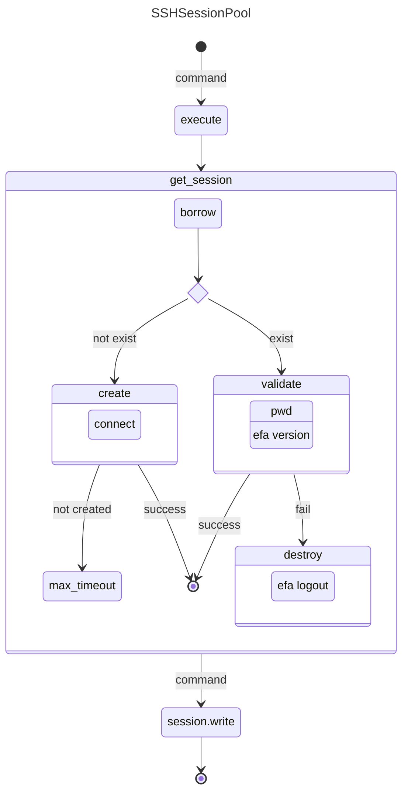

```mermaid
---
title: SSHSessionPool
---
stateDiagram-v2

    classDef fail fill:#f00,color:white,font-weight:bold,stroke-width:2px,stroke:yellow
    exception:::fail:max_timeout

    [*] --> execute: command
    execute --> get_session

    state get_session {
        direction TB

        state if_state <<choice>>
        borrow --> if_state
        if_state --> validate: exist
        if_state --> create : not exist
        create --> exception: not created 

        validate --> [*]:success
        validate --> destroy: fail
        
        create --> [*]:success
    }

    state create {
        direction LR
        _c: connect
    }
    state destroy {
        direction LR
        _d: efa logout
    }

    state validate {
        direction LR
        _v: pwd 
        _v: efa version
    }


    get_session --> session.write: command
    session.write --> [*]
```