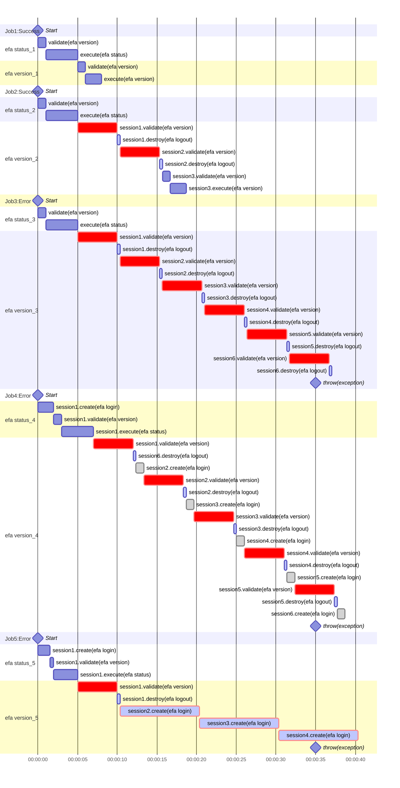

```mermaid
gantt
    dateFormat HH:mm:ss
    axisFormat %H:%M:%S
    
    section Job1:Success
        Start: milestone, 00:00:00, 0s
        section efa status_1
            validate(efa version): 1s
            execute(efa status): 4s
        section efa version_1
            validate(efa version): 1s
            execute(efa version): 2s

    section Job2:Success
        Start: milestone, 00:00:00, 0s
        section efa status_2
            validate(efa version): 1s
            execute(efa status): 4s
        section efa version_2
            session1.validate(efa version): crit, 5s
            session1.destroy(efa logout): active, 350ms
            session2.validate(efa version): crit, 5s
            session2.destroy(efa logout): active, 350ms
            session3.validate(efa version): 1s
            session3.execute(efa version): 2s

    section Job3:Error
        Start: milestone, 00:00:00, 0s
        section efa status_3
            validate(efa version): 1s
            execute(efa status): 4s

        section efa version_3
            session1.validate(efa version): crit, 5s
            session1.destroy(efa logout): active, 340ms
            session2.validate(efa version): crit, 5s
            session2.destroy(efa logout): active, 340ms
            session3.validate(efa version): crit, 5s
            session3.destroy(efa logout): active, 340ms
            session4.validate(efa version): crit, 5s
            session4.destroy(efa logout): active, 340ms
            session5.validate(efa version): crit, 5s
            session5.destroy(efa logout): active, 340ms
            session6.validate(efa version): crit, 5s
            session6.destroy(efa logout): active, 340ms
            throw(exception): milestone, 00:00:30, 10s

    section Job4:Error
        Start: milestone, 00:00:00, 0s
        section efa status_4
            session1.create(efa login): 2s
            session1.validate(efa version): 1s
            session1.execute(efa status): 4s

        section efa version_4
            session1.validate(efa version): crit, 5s
            session6.destroy(efa logout): active, 340ms
            session2.create(efa login): done, 1s
            session2.validate(efa version): crit, 5s
            session2.destroy(efa logout): active, 340ms
            session3.create(efa login): done, 1s
            session3.validate(efa version): crit, 5s
            session3.destroy(efa logout): active, 340ms
            session4.create(efa login): done, 1s
            session4.validate(efa version): crit, 5s
            session4.destroy(efa logout): active, 340ms
            session5.create(efa login): done, 1s
            session5.validate(efa version): crit, 5s
            session5.destroy(efa logout): active, 340ms
            session6.create(efa login): done, 1s
            throw(exception): milestone, 00:00:30, 10s

    section Job5:Error
        Start: milestone, 00:00:00, 0s
        section efa status_5
            session1.create(efa login): 1.5s
            session1.validate(efa version): 0.5s
            session1.execute(efa status): 3s

        section efa version_5
            session1.validate(efa version): crit, 5s
            session1.destroy(efa logout): active, 340ms
            session2.create(efa login): crit, active, 10s
            session3.create(efa login): crit, active, 10s
            session4.create(efa login): crit, active, 10s
            throw(exception): milestone, 00:00:30, 10s

```